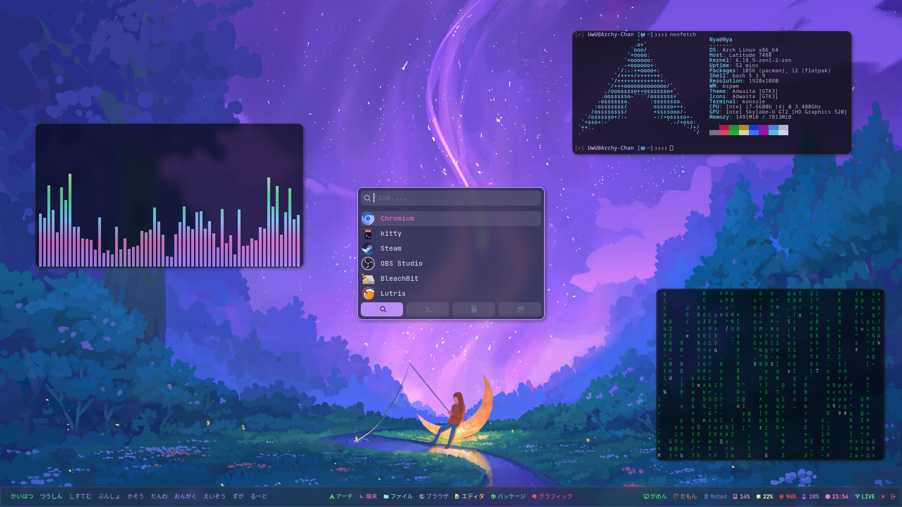
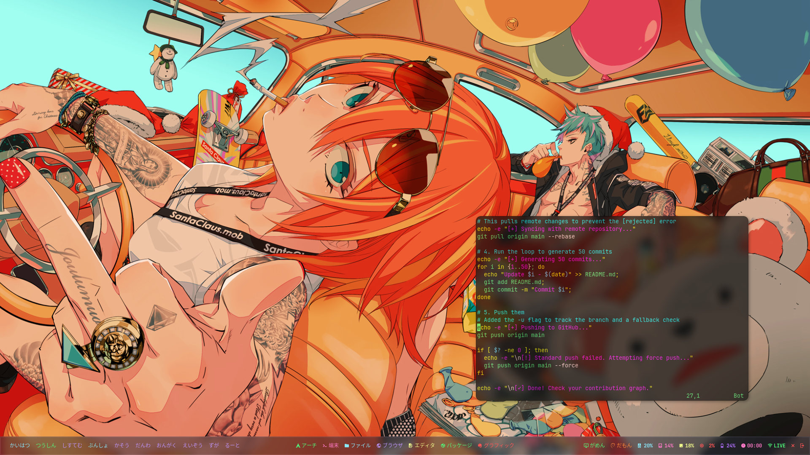
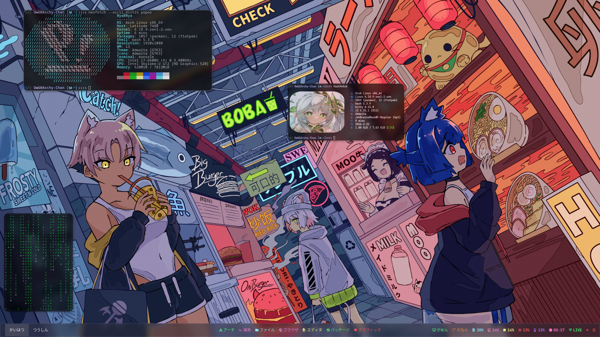

# 🎀 nya.dotfiles
<p align="center">
  
  <br>
  <b>A sophisticated, high-performance Arch Linux environment.</b>
  <br>
  <i>Minimalism meets productivity through bspwm and i3-gaps.</i>
</p>

<p align="center">
  <a href="https://archlinux.org/"></a>
  <a href="https://github.com/baskerville/bspwm"></a>
  <a href="https://github.com/i3/i3"></a>
  <a href="https://www.gnu.org/software/bash/"></a>
</p>

---

## 📸 Visual Showcase

Explore the interface and workflow.

<details>
  <summary>✨ Click to view screenshots</summary>
  <br>
  <p align="center">
    
    
    <br>
    
    
  </p>
</details>

---

## ⚡ Core Philosophy

| 🚀 **Performance** | 🎨 **Aesthetics** |
| :--- | :--- |
| **GPU Acceleration:** Utilizing Kitty and Picom for zero-lag rendering and tear-free windowing. | **Visual Polish:** Soft shadows, Gaussian blur, and a curated color palette for long-term comfort. |
| **⌨️ Efficiency** | **📂 Organization** |
| **Modal Control:** A keyboard-driven workflow powered by `sxhkd` to minimize mouse reliance. | **XDG Standard:** Clean `$HOME` directory following XDG Base Directory specifications. |

---

## 🛠️ Info

| Component | Choice |
| :--- | :--- |
| **Distro** | [Arch Linux](https://archlinux.org/) |
| **Window Managers** | `bspwm` (Main) / `i3-gaps` (Alternative) |
| **Hotkeys** | `sxhkd` |
| **Compositor** | `Picom` (Pijulius/Jonaburg fork) |
| **Terminals** | `Kitty` / `Xterm` |
| **Launchers** | `Rofi` / `Dmenu` |

---

## 🚀 Installation

> [!IMPORTANT]
> This installation script is designed for Arch Linux. It is recommended to review the `nya.sh` script before execution to ensure compatibility with your hardware.

```bash
# Clone the repository
git clone https://github.com/x11kitty/nya.git

# Navigate into the directory
cd nya

# Give execution permissions and run the installer
chmod +x nya.sh
./nya.sh
```
<div align="center">
  
  <p><i>"Code less. Automate more. ✨"</i></p>
</div>

### ⌨️ Keybindings

| Shortcut | Action |
| :--- | :--- |
| `Super + T` | Open Terminal |
| `Super + Q` | Close Windows |
| `Super + Shift + X` | Focus window in direction |
| `Super + R` | App Launcher (Rofi) |
| `Super + D` | App Launcher (Dmenu) |

---
