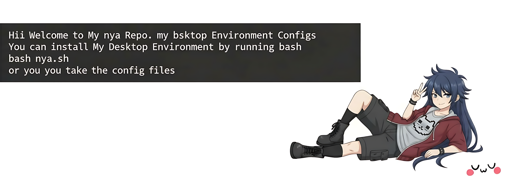

# uwu 🎀


<p align="center">
  <h1 align="center">My Arch Linux Dotfiles</h1>
  <p align="center">
    A minimal, tiling window manager setup built for speed and aesthetics.
  </p>
</p>

<p align="center">
  
  
  
  
</p>

---

## 🛠️ Info :-
<p align="left">     </p>

## 🚀 Installation

To replicate this setup, clone the repository and move the config files to your `.config` directory:

```bash
# Clone the repo
git clone https://github.com/x11kitty/uwu.git
```

### ⌨️ Keybindings

| Shortcut | Action |
| :--- | :--- |
| `Super + T` | Open Terminal |
| `Super + Q` | Close Windows |
| `Super + Shift + X` | Focus window in direction |
| `Super + R` | App Launcher (Rofi) |
| `Super + D` | App Launcher (Dmenu) |
